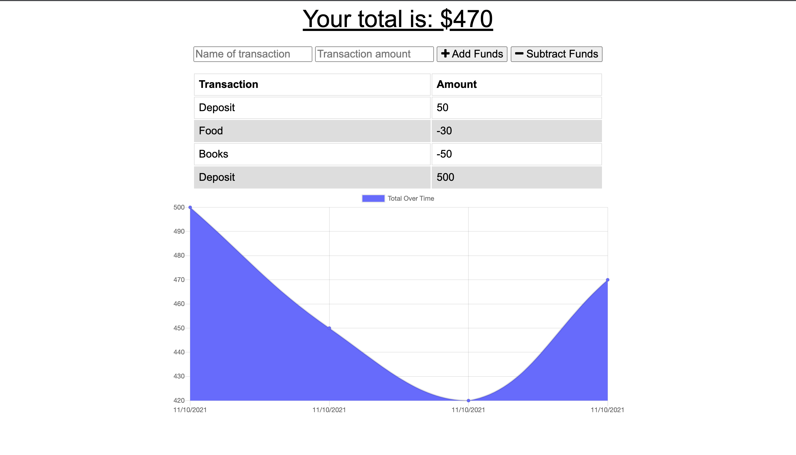

# Budget Tracker

The budget tracker application allows users to add expenses and deposits to their budget with or without an internet connection. If the user enters transactions offline, the total will be updated when they are back online.

[https://arcane-brushlands-96993.herokuapp.com](https://arcane-brushlands-96993.herokuapp.com)